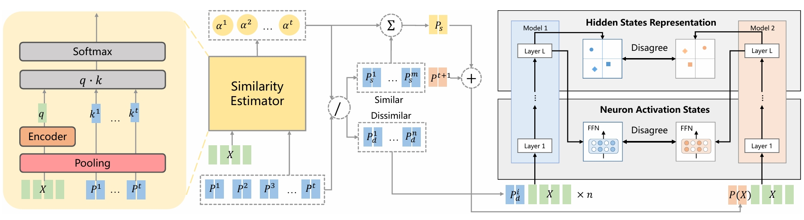

# SHLPT

This repo contains the code for the paper "[Mitigate Negative Transfer with Similarity Heuristic Lifelong Prompt Tuning](https://arxiv.org/pdf/2406.12251)", ACL 2024 Findings.

In this paper, we introduce a similarity heuristic method to mitigate negative transfer when learning a sequence of tasks. We identify the misalignment between algorithm selection and task specificity as the primary cause of negative transfer. Later we propose our method as shown below.


Figure: Illustration of our method SHLPT. The previous task prompts are partitioned based on an instance-wise similarity. Then, different transfer learning algorithm is applied on similar and dissimilar task scenarios. Similar tasks' prompts are composed and added to current task prompt. The current task's model behavior and representation are pushed away from those of dissimilar tasks. Only current task's prompt $P^{t+1}$ and encoder in similarity estimator are trainable.


## Environment Setup

Please run
```
pip install -r requirements.txt
```
to install the necessary packages.

## Dataset

Due to size constraints, some datasets (dbpedia_14, MNLI, yahoo_answers_topics) are not hosted there, please download them from [dataset](https://drive.google.com/drive/folders/1xZNSQLWbM52ktJvXpJKg_M-TLEJptrfU?usp=sharing) and place them in the specified directory.

## Run SHLPT

For example, you can run SHLPT on Standard CL Benchmark with order1:

```bash
cd src

python batch_run.py
```

Or you can further modify `batch_run.py` to train and evaluate SHLPT on different order or benchmarks. For instance, to switch from order1 on the Standard CL Benchmark to order1 on the Large Number of Tasks benchmark, modify:
```python
batch_run_interactive(cmd_standard_cl_benchmark_order1)
```
to
```python
batch_run_interactive(cmd_large_number_of_tasks_order1)
```

## Questions

If you have any questions about our paper or code, please email Chenyuan (`wuchenyuan <at> mail.ustc.edu.cn`) or open an issue.

## Citation

If you find this repo helpful, please cite SHLPT by:

```bibtext
@inproceedings{wu-etal-2024-mitigate,
    title = "Mitigate Negative Transfer with Similarity Heuristic Lifelong Prompt Tuning",
    author = "Wu, Chenyuan  and
      Jiang, Gangwei  and
      Lian, Defu",
    editor = "Ku, Lun-Wei  and
      Martins, Andre  and
      Srikumar, Vivek",
    booktitle = "Findings of the Association for Computational Linguistics ACL 2024",
    month = aug,
    year = "2024",
    address = "Bangkok, Thailand and virtual meeting",
    publisher = "Association for Computational Linguistics",
    url = "https://aclanthology.org/2024.findings-acl.650",
    pages = "10944--10959",
```
